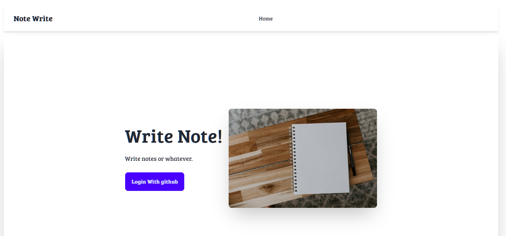
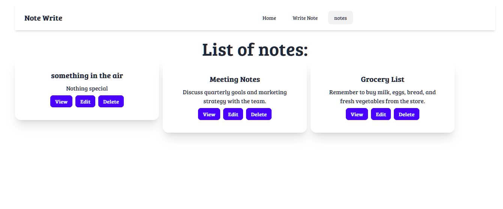

# Note writer
Simple note writing app.Demonstrating CRUD operations.

# Run locally
Clone the repo
```
git clone https://github.com/afaiyaz006/Note-Write
```
Install dependencies
```
npm install
```
Run
```
npm run dev
```
To build the application
```
npm run build
```
Create a file named ```.env.local```. Create a <a href="https://docs.github.com/en/apps/creating-github-apps/about-creating-github-apps/about-creating-github-apps#building-a-github-app">github app</a> and add  github ID and github secrets.Add following information to ```.env.local``` 
```
NEXTAUTH_SECRET="ANYTHING"
GITHUB_ID="ID"
GITHUB_SECRET="SECRET"
POSTGRES_URL="URL"
```


# Libraries used
1. Database : Postgres
2. ORM : Drizzle ORM
3. Authentication : next-auth (Added only github as login provider so login with github only.)
4. Frontend : NextJS (using latest App based routing) 
5. CSS : Tailwind CSS+ Daisy UI
# Is this app secure?
Maybe
# Screenshots






